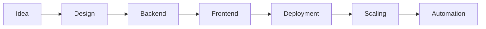

<!--
========================================================================
  ALIVELYYY — TOP 1% GITHUB PROFILE
  Identity • Systems • Authority
========================================================================
-->

<div align="center">

# ⚡ ALIVE

### Building Systems That Actually Run in Production


<br>


</div>

---

## 🧬 Developer Identity

```diff
+ Name: Alive
+ Type: System Builder
+ Speciality: Discord Ecosystems + Web Platforms
+ Strength: Turning ideas → working products
```

---

## 🧠 Philosophy

```text
Most people build features.
I build systems.

Most people stop at UI.
I go into infrastructure.

Most people start projects.
I ship them.
```

---

## 🏗️ System Architecture Mindset



---

## 🚀 Flagship Systems

<div align="center">

| System         | Type            | Status          |
| -------------- | --------------- | --------------- |
| Mimi           | Music Bot       | 🟢 Live         |
| Encore         | Bot + Dashboard | 🟢 Live         |
| Sentinel       | Security Bot    | 🟢 Open Source  |
| Vyrix          | Media Hosting   | 🟢 Running      |
| Mail System    | Email Platform  | 🟡 Experimental |
| Node Monitor   | Lavalink Infra  | 🟢 Active       |
| Support System | Ticket + AI     | 🟢 Production   |

</div>

---

## 🌐 Live Ecosystem

<div align="center">

[](https://ofcalive.com)
[](https://mimibot.app)
[](https://encorebot.me)
[](https://node.mimibot.app)
[](https://support.mimibot.app)
[](https://vyrix.xyz)

</div>

---

## ⚙️ Tech Arsenal

<p align="center">
  
</p>

```text
Core: JavaScript, Lua, Python
Focus: Backend Systems + APIs + Real-time
Tools: Discord API, Node, Git, Automation
```

---

## 📊 Developer Analytics

<div align="center">
  
  
</div>

---

## 🧑‍💻 Live Status

<div align="center">
  
</div>

---

## 🧩 Current Focus

```bash
> building scalable platforms
> improving backend systems
> expanding bot ecosystem
> experimenting with AI tools
```

---

## 📞 Connect

<div align="center">

[](https://support.mimibot.app)
[](https://instagram.com/ofc__alive)

</div>

---

<div align="center">

# ⚡ "While others learn, I build."

</div>
